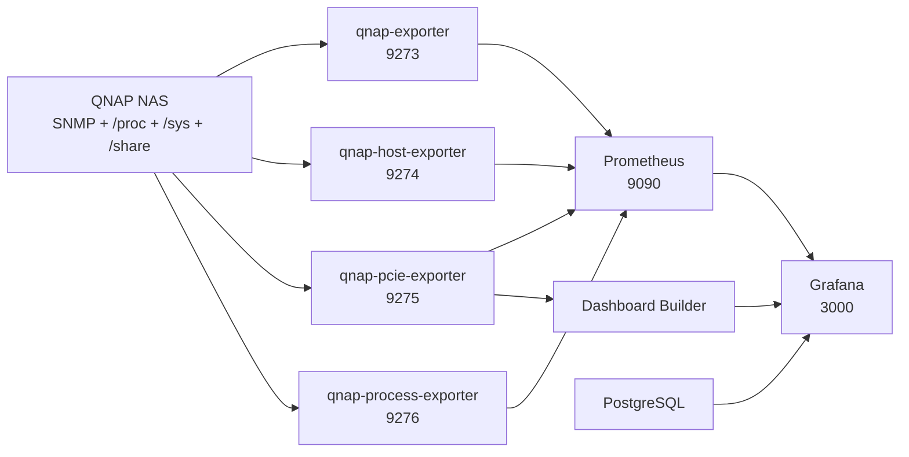

# QNAP 统一监控 v8.6 重构版

面向威联通 QTS 与 QuTS hero 的完整监控项目。它以原始“QNAP 统一监控
v8.6”为功能基准，保留 SNMP、宿主机、硬盘、共享文件夹、PCIe/GPU、
高负载进程、Prometheus、PostgreSQL 和中文 Grafana Dashboard。

生产环境直接拉取现有 Docker Hub 镜像：

```text
ydxian/qnap-monitor-one
```

## 主要特点

- 支持 QTS 与 QuTS hero 自动识别。
- 支持 `CACHEDEV*_DATA` 与 `ZFS*_DATA` 数据卷。
- 识别 QuTS hero ZFS ARC。
- 保留原始 v8.6 Prometheus Job、指标名称、Dashboard 查询和字段映射。
- SNMP 使用 Telegraf 内置 `gosmi` Translator，同时保留 Net-SNMP
  命令作为兼容与诊断工具。
- 全部独立 Shell 文件已还原 Compose 的 `$$` 转义，并通过 `/bin/sh -n`。
- 所有项目脚本在镜像中统一位于 `/opt/qnap/scripts`。
- 单个采集模块失败不会停止 PostgreSQL、Prometheus 或 Grafana。
- 自定义镜像支持 `linux/amd64` 与 `linux/arm64`。
- GitHub Actions 先验证完整服务组，再发布 Docker Hub 与 GHCR。

## 架构

一个自定义镜像由五个相互隔离的容器按不同入口运行。这样保留现有
`ydxian/qnap-monitor-one` 镜像仓库，同时恢复 v8.6 的服务职责和权限边界。



| 服务 | 职责 | 容器端口 | 默认 QNAP 端口 |
| --- | --- | ---: | ---: |
| `qnap-exporter` | QNAP SNMP、CPU、温度、风扇、硬盘、SNMP 网络 | 9273 | 39273 |
| `qnap-host-exporter` | 内存、数据卷、共享文件夹、物理网卡、硬盘缓存 | 9274 | 39274 |
| `qnap-pcie-exporter` | PCIe、GPU、扩展网卡、NVMe、传感器 | 9275 | 39275 |
| `qnap-process-exporter` | 当前高负载进程 Top N | 9276 | 39276 |
| `prometheus` | 指标抓取与历史存储 | 9090 | 39090 |
| `qnap-dashboard-builder` | 按实际 PCIe 能力生成 Dashboard | — | — |
| `grafana-postgres` | Grafana 数据库 | 5432 | 不公开 |
| `grafana` | 中文监控 Dashboard | 3000 | 3300 |

## 支持范围

### QNAP 系统

- QTS：EXT 系文件系统和 `CACHEDEV*_DATA`。
- QuTS hero：ZFS、`ZFS*_DATA`、`/proc/lpl` 或 `/proc/spl` ARC。

### CPU 架构

- `linux/amd64`：适用于 TS-673A、TS-873A 等 x86-64 QNAP。
- `linux/arm64`：自定义镜像和官方依赖均可构建 ARM64。

PCIe/GPU 指标仍取决于目标 NAS 的内核、驱动和 QNAP 厂商工具。QNAP
NVIDIA 驱动中的 `nvidia-smi` 必须与 NAS 自身架构匹配；项目不会把
x86-64 厂商二进制复制进 ARM64 镜像。

## 一、启用 QNAP SNMP

进入 QNAP 控制台的 SNMP 设置页面：

```text
控制台 → 网络与文件服务（或网络和虚拟交换机）→ SNMP
```

1. 启用 SNMP 服务。
2. 启用 SNMP v1/v2c。
3. 设置 Community。
4. 允许 Container Station 网络访问 UDP 161。
5. 将相同 Community 写入 `.env` 的 `SNMP_COMMUNITY`。

不同 QTS/QuTS 版本的菜单名称可能略有差异。

## 二、准备项目目录

把整个仓库上传到：

```text
/share/Container/qnap-monitoring
```

最终至少应包含：

```text
/share/Container/qnap-monitoring/
├── .env
├── docker-compose.yml
├── prometheus/prometheus.yml
├── grafana/provisioning/
├── postgres-data/
├── prometheus-data/
├── grafana-data/
├── host-cache/
├── pcie-cache/
└── dashboard-runtime/
```

数据目录可由 Container Station 自动创建，也可以提前通过 File Station
建立。

## 三、配置 `.env`

复制模板：

```sh
cp .env.example .env
```

必须修改：

```env
NAS_IP=192.168.1.100
QNAP_HOSTNAME=QNAP-NAS
SNMP_COMMUNITY=change_me

GF_SECURITY_ADMIN_USER=admin
GF_SECURITY_ADMIN_PASSWORD=change_me

POSTGRES_PASSWORD=change_me
GF_DATABASE_PASSWORD=change_me
```

`POSTGRES_PASSWORD` 与 `GF_DATABASE_PASSWORD` 必须相同。

常用配置：

| 变量 | 默认值 | 说明 |
| --- | --- | --- |
| `QNAP_PROJECT_ROOT` | `/share/Container/qnap-monitoring` | Compose、`.env`、Prometheus 和 Grafana 配置目录 |
| `QNAP_DATA_ROOT` | `/share/Container/qnap-monitoring` | 持久化数据根目录 |
| `DOCKERHUB_NAMESPACE` | `ydxian` | 保留的 Docker Hub 命名空间 |
| `IMAGE_TAG` | `latest` | 镜像版本，可设置为 `2.0.0` 回滚 |
| `NAS_IP` | `192.168.1.100` | QNAP NAS IP |
| `QNAP_HOSTNAME` | `QNAP-NAS` | Dashboard 中显示的名称 |
| `SNMP_COMMUNITY` | `change_me` | 必须与 QNAP 设置一致 |
| `QNAP_DATA_VOLUME_NAME` | 空 | 可选，指定 `ZFS*_DATA` 或 `CACHEDEV*_DATA` |
| `QNAP_SHARE_SCAN_INTERVAL` | `3600` | 共享文件夹深度扫描周期，秒 |
| `PROMETHEUS_RETENTION` | `30d` | Prometheus 历史保留时间 |
| `QNAP_PCIE_INCLUDE_BDFS` | 空 | 强制加入 PCI 地址，逗号分隔 |
| `QNAP_PCIE_EXCLUDE_BDFS` | 空 | 强制排除 PCI 地址，逗号分隔 |
| `QNAP_PROCESS_TOP_N` | `15` | 高负载进程数量 |

真实 `.env` 已被 `.gitignore` 排除，不得提交到 GitHub。

## 四、Container Station 部署

1. 上传项目目录并创建 `.env`。
2. 打开 **Container Station → 应用程序 → 创建**。
3. 应用名称填写 `qnap-monitoring`。
4. 粘贴 [`docker-compose.yml`](docker-compose.yml) 的完整内容。
5. 点击验证。
6. 创建并等待所有容器启动。

生产 Compose 只拉取已发布的自定义镜像，不要求 NAS 本地构建：

```yaml
image: ydxian/qnap-monitor-one:latest
```

只有 `qnap-pcie-exporter` 使用 `privileged: true`；其他容器不会继承该权限。

## 五、命令行部署

在项目目录执行：

```sh
docker compose pull
docker compose up -d --remove-orphans
docker compose ps
```

查看日志：

```sh
docker compose logs --tail=200 qnap-exporter
docker compose logs --tail=200 qnap-host-exporter
docker compose logs --tail=200 qnap-pcie-exporter
docker compose logs --tail=200 qnap-process-exporter
docker compose logs --tail=200 qnap-dashboard-builder
docker compose logs --tail=200 prometheus
docker compose logs --tail=200 grafana
```

## 六、访问地址

Grafana：

```text
http://NAS_IP:3300
```

Prometheus：

```text
http://NAS_IP:39090
```

Prometheus Targets：

```text
http://NAS_IP:39090/targets
```

独立显示屏：

```text
http://NAS_IP:3300/d/qnap-nas-cn-v2/?kiosk
```

## 七、QNAP 宿主机挂载

以下挂载是 QNAP 采集功能的一部分，不是通用模板残留：

| 宿主机路径 | 容器路径 | 权限 | 用途 |
| --- | --- | --- | --- |
| `/share` | `/share` | 只读 | QTS/QuTS 数据卷与共享文件夹 |
| `/proc` | `/host-proc` | 只读 | 内存、网络、ZFS ARC、进程、NVIDIA |
| `/sys` | `/host-sys` | 只读 | 物理网卡、PCIe、GPU、NVMe、hwmon |
| `/etc/config` | `/host-etc-config` | 只读 | QNAP `smb.conf`、`qpkg.conf`、用户映射 |

持久化目录：

```text
/share/Container/qnap-monitoring/postgres-data
/share/Container/qnap-monitoring/prometheus-data
/share/Container/qnap-monitoring/grafana-data
/share/Container/qnap-monitoring/host-cache
/share/Container/qnap-monitoring/pcie-cache
/share/Container/qnap-monitoring/dashboard-runtime
```

## 八、Prometheus Jobs 与兼容指标

保留的 Job：

```text
qnap_exporter
qnap_host_exporter
qnap_pcie_exporter
qnap_process_exporter
```

保留的主要指标包括：

```text
qnap_system_cpu_usage
qnap_system_uptime_seconds
qnap_system_cpu_temperature_celsius
qnap_system_system_temperature_celsius
qnap_disk_temperature_celsius
qnap_fan_speed_rpm
qnap_host_memory_used_percent
qnap_host_network_receive_bytes_total
qnap_host_network_transmit_bytes_total
qnap_disk_inventory_capacity_bytes
qnap_shared_folder_summary_total_bytes
qnap_shared_folder_summary_used_bytes
qnap_shared_folder_summary_free_bytes
qnap_shared_folder_summary_used_percent
```

## 九、更新与回滚

更新 `latest`：

```sh
docker compose pull
docker compose up -d --remove-orphans
```

固定版本：

```env
IMAGE_TAG=2.0.0
```

回滚：

1. 将 `IMAGE_TAG` 改成上一个版本，例如 `2.0.0`。
2. 执行：

```sh
docker compose pull
docker compose up -d --remove-orphans
```

确认正常后才清理旧镜像：

```sh
docker image prune -f
```

## 十、镜像标签和自动发布

GitHub 仓库：

```text
https://github.com/1945251yyq/qnap-monitor-one
```

镜像仓库：

```text
docker.io/ydxian/qnap-monitor-one
ghcr.io/1945251yyq/qnap-monitor-one
```

推送到 `main` 后发布：

```text
latest
main
sha-短提交号
```

推送 `v2.0.0` 标签后发布：

```text
2
2.0
2.0.0
latest
```

GitHub Actions 流程：

1. 执行静态项目验证。
2. 执行 `docker compose config`。
3. 构建自定义镜像。
4. 启动完整八服务测试栈。
5. 检查四个 Exporter、Prometheus、Grafana 和动态 Dashboard。
6. 验证成功后构建 AMD64/ARM64。
7. 同时推送 Docker Hub 与 GHCR。

验证失败不会推送镜像。

## 十一、本地开发

复制配置：

```sh
cp .env.example .env
```

静态验证：

```sh
./scripts/validate-project.sh
```

Compose 验证：

```sh
docker compose config
```

本地构建和启动：

```sh
docker compose \
  -f docker-compose.yml \
  -f docker-compose.dev.yml \
  up -d --build
```

完整冒烟测试：

```sh
./scripts/smoke-test.sh
```

## 十二、专项检查

### 检查 Compose 转义残留

真实 `.sh`、`.conf` 和 `.py` 文件不应包含 Compose 双美元转义：

```sh
grep -R -nE '\$\$\(|\$\$\{|\$\$[0-9]' \
  exporter pcie-exporter process-exporter dashboard-builder prometheus grafana
```

预期无输出。`docker-compose.yml` 中 PostgreSQL 健康检查的
`$$POSTGRES_USER` 属于正确的 Compose 延迟展开，不在上述检查范围内。

### 检查 Shell 语法

```sh
find . -type f -name '*.sh' -print |
while IFS= read -r file; do
  echo "Checking ${file}"
  /bin/sh -n "${file}"
done
```

### 检查 SNMP Translator 和命令

```sh
docker exec qnap-exporter \
  grep 'snmp_translator' /opt/qnap/config/qnap-snmp.conf

docker exec qnap-exporter command -v snmptable
docker exec qnap-exporter command -v snmpwalk
docker exec qnap-exporter command -v snmptranslate
```

预期 Translator 是 `gosmi`，三个 Net-SNMP 命令均存在。

### 检查容器内文件路径

```sh
docker exec qnap-host-exporter \
  find /opt/qnap -maxdepth 3 -type f -print
```

所有 QNAP Shell 与 Python 脚本只应位于 `/opt/qnap/scripts`。

### 检查平台识别

```sh
docker exec qnap-host-exporter /bin/sh -c '
  . /opt/qnap/scripts/qnap-detect-platform.sh
  qnap_detect_platform
  env | grep "^QNAP_" | sort
'
```

正常示例：

```text
QNAP_DETECTED_PLATFORM=quts_hero
QNAP_DETECTED_FS=zfs
QNAP_DETECTED_VOLUME_NAME=ZFS18_DATA
```

### 检查 Prometheus Targets

访问：

```text
http://NAS_IP:39090/targets
```

四个 `qnap_*` Job 应为 `UP`。某个硬件指标为空不代表 Exporter 必须退出。

## 十三、常见问题

### `cannot open /opt/qnap/qnap-detect-platform.sh`

这是旧版本路径混用错误。新镜像统一使用：

```text
/opt/qnap/scripts/qnap-detect-platform.sh
```

确认容器使用的是新版镜像标签并已重新创建。

### `Syntax error: "(" unexpected`

检查独立文件是否仍有 `$$(...)`：

```sh
./scripts/validate-project.sh
```

新项目的独立文件只允许 `$(...)`。

### `snmptable: executable file not found`

新配置使用 `gosmi`，镜像仍安装了 `net-snmp-tools`。检查：

```sh
docker exec qnap-exporter telegraf --version
docker exec qnap-exporter command -v snmptable
docker compose logs --tail=200 qnap-exporter
```

### SNMP 指标为空

- 检查 QNAP 是否启用 SNMP v2c。
- 检查 `.env` 中 `NAS_IP` 与 `SNMP_COMMUNITY`。
- 检查 UDP 161 防火墙。
- 从同一 Docker 网络测试 SNMP：

```sh
docker exec qnap-exporter \
  snmpwalk -v2c -c "$SNMP_COMMUNITY" "$NAS_IP" \
  1.3.6.1.4.1.24681.1.3
```

不要把真实 Community 复制到公开日志。

### 共享文件夹扫描失败

扫描失败会保留最后一个有效缓存并重试，不会停止 Telegraf。检查：

```sh
docker compose logs --tail=200 qnap-host-exporter
ls -la /share/Container/qnap-monitoring/host-cache
```

### PCIe 或 GPU 没有数据

- 确认使用项目中的完整 Compose。
- 确认 `qnap-pcie-exporter` 是唯一特权容器。
- 确认 QNAP GPU 驱动已安装。
- 无法自动识别时填写 `QNAP_PCIE_INCLUDE_BDFS`。
- 某设备没有传感器时项目不会伪造温度、功耗或风扇数据。

### Dashboard 未生成

```sh
docker compose logs --tail=200 qnap-dashboard-builder
ls -la /share/Container/qnap-monitoring/dashboard-runtime
```

首次无法连接 PCIe Exporter 时，Builder 会生成不含 PCIe 面板的有效
Dashboard；后续失败会保留最后一个有效文件。

### Grafana 无法连接 PostgreSQL

确认以下值一致：

```env
POSTGRES_DB=grafana
POSTGRES_USER=grafana
POSTGRES_PASSWORD=同一个密码
GF_DATABASE_NAME=grafana
GF_DATABASE_USER=grafana
GF_DATABASE_PASSWORD=同一个密码
```

## 十四、备份与隐私

升级前停止应用并备份所有持久化目录，重点是：

```text
postgres-data
prometheus-data
grafana-data
dashboard-runtime
```

高负载进程表会读取进程名、用户、PID 和命令行。脚本会遮蔽常见的
password、token、secret、community 等参数，但无法保证识别所有敏感信息。
不要把 Exporter 或 Grafana 直接暴露到互联网。

## 十五、已知限制

- 当前环境没有真实 QNAP SNMP OID 模拟器，最终 OID 返回值必须在目标 NAS
  上验证。
- 不同 QTS/QuTS 固件可能缺少部分 QNAP MIB 表。
- ARM64 镜像可启动，但 QNAP 厂商 GPU 工具是否提供 ARM64 版本取决于设备。
- `qnap-pcie-exporter` 需要特权模式；不需要 PCIe/GPU 时可以停止该服务，
  其他监控仍会继续。
- 共享文件夹深度扫描可能耗时，默认每小时执行一次并使用持久缓存。

第三方组件说明见
[`THIRD_PARTY_NOTICES.md`](THIRD_PARTY_NOTICES.md)。
